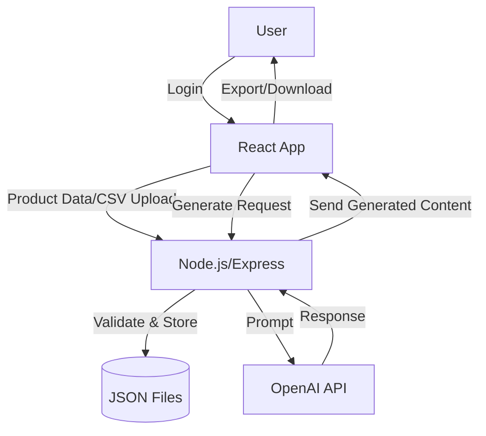
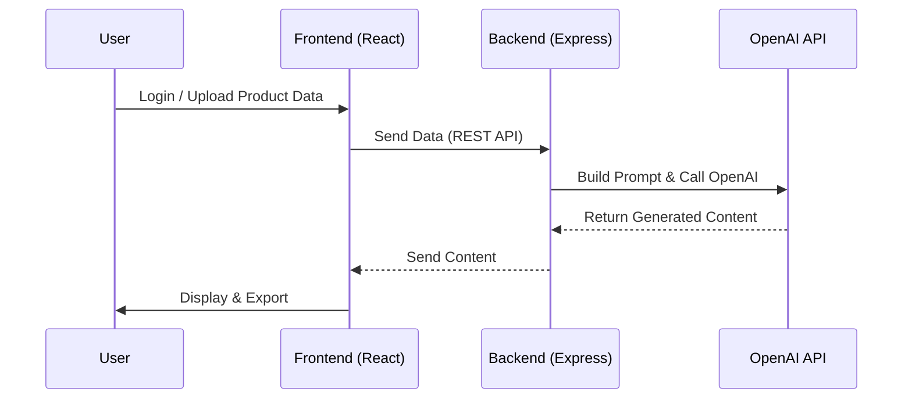
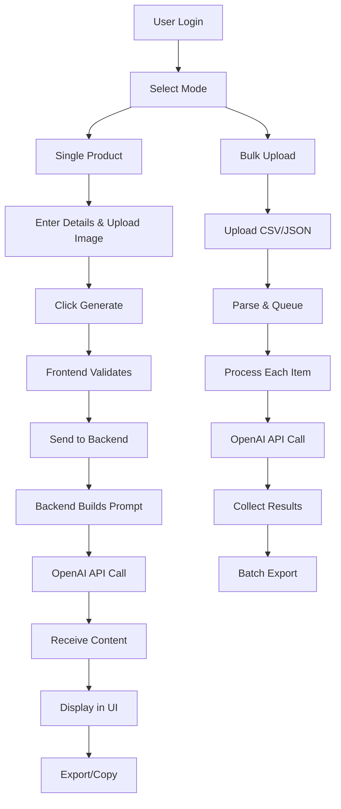

# share

# ContentGenius AI 🛍️

**ContentGenius AI** is a professional-grade, high-fidelity SaaS application designed for e-commerce merchants, agencies, and copywriters. It leverages **Google's Gemini 2.5 Flash** model to generate conversion-optimized product titles, descriptions, SEO metadata, and social media copy.


## ✨ Key Features

### 1. Single Product Mode (Multimodal)
- **Visual Analysis**: Drag & drop product images. The AI analyzes visual traits (color, material, texture) to enrich descriptions.
- **Detailed Inputs**: Configure Brand, Category, Features, Tone, Channel, and Language.
- **Comprehensive Output**: Generates:
  - **Strategy Note**: Why the copy was written this way.
  - **Optimized Title**: High-visibility naming.
  - **Feature Bullets**: 5 key selling points.
  - **HTML Description**: Ready-to-paste rich text.
  - **SEO Package**: Meta Title, Description, and Keywords.
  - **Social Post**: Instagram/Facebook ready copy with hashtags.

### 2. Bulk Upload Engine 🚀
- **Mass Generation**: Process hundreds of products via **CSV** or **JSON**.
- **Queue Management**: Real-time progress tracking with `Idle` -> `Pending` -> `Success` states.
- **Error Handling**: Skips failed items without stopping the queue.
- **Batch Export**: Download all generated content in a single JSON file.

### 3. Export & Integration
- **Formats**: Export individual results as **DOCX**, **PDF**, or **JSON**.
- **Clipboard**: One-click copy for all sections.

---

## 🛠️ Technical Stack

- **Frontend**: React 19, TypeScript
- **Styling**: Tailwind CSS (Custom "Slate & Blue" SaaS Theme)
- **Icons**: Lucide React
- **AI Model**: Google Gemini 2.5 Flash (via `@google/genai` SDK)
- **State Management**: React Hooks (Local State)

---

## 🚀 Getting Started

### Prerequisites
- Node.js (v18+)
- A Google Gemini API Key

### Installation

1. **Clone the repository**
   ```bash
   git clone https://github.com/your-username/content-genius-ai.git
   cd content-genius-ai
   ```

2. **Install dependencies**
   ```bash
   npm install
   ```

3. **Configure Environment**
   Ensure your API key is available in your environment variables.
   ```bash
   export API_KEY="your_gemini_api_key_here"
   ```

4. **Run the Application**
   ```bash
   npm start
   ```

---

## 📂 Project Structure

```
├── components/
│   ├── ui/                 # Reusable atoms (Button, Input, Icons)
│   ├── Dashboard.tsx       # Main Layout & Tab Controller
│   ├── SingleProductMode.tsx # Single Item Generation Logic
│   ├── BulkProductMode.tsx   # Bulk Queue & CSV Parsing Logic
│   ├── ProductContentPreview.tsx # Output Display & Export Logic
├── services/
│   └── geminiService.ts    # Gemini API Integration (Multimodal)
├── types.ts                # TypeScript Interfaces
├── App.tsx                 # Root Component
└── index.tsx               # Entry Point
```

---

## 🎨 Design System

The UI follows a modern **"Clean SaaS"** aesthetic:
- **Background**: Soft White `#F8FAFD`
- **Primary Color**: Royal Blue `#2563EB`
- **Typography**: Inter (Google Fonts)
- **Cards**: White with subtle borders & soft shadows
- **Interactive Elements**: Hover states, focus rings, and active scaling.

---

## 🗂️ Data Flow Diagram (OpenAI Only)


## ⚙️ Technical Flow Diagram


## 🏗️ Architecture Diagram
```mermaid
flowchart LR
    subgraph Frontend
        F1[React 19]
        F2[Tailwind CSS]
        F3[Lucide Icons]
    end
    subgraph Backend
        B1[Node.js/Express]
        B2[OpenAI SDK]
        B3[Data Storage (JSON)]
    end
    F1 -->|REST API| B1
    F2 --> F1
    F3 --> F1
    B1 --> B2
    B1 --> B3
    B2 -->|API Call| OpenAI
```

## 🔄 Workflow Diagram (Single Product & Bulk)


---

## 📄 License

MIT License. Free to use for personal and commercial projects.
